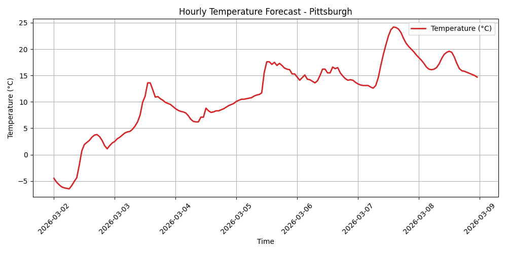

# 🌦️ Pittsburgh Weather Fetcher



This Python script retrieves hourly weather forecast data for **Pittsburgh, PA** using the [Open-Meteo API](https://open-meteo.com/), saves the results as JSON, generates a temperature plot, and creates convenient symbolic links for easy access.

---

## 📌 Features

- ✅ Fetches **current and forecasted weather** from Open-Meteo (no API key required)
- ✅ Saves JSON response to `data/YYYYMMDD.json`
- ✅ Generates a temperature plot as `data/YYYYMMDD.png`
- ✅ Creates symlinks:
  - `data/weather.json` → today's JSON
  - `data/weather.png` → today's plot

---

## 📂 Output Structure
```
data/
├── 20250728.json # Raw weather data (example date)
├── 20250728.png # Hourly temperature plot
├── weather.json # Symlink to latest .json file
└── weather.png # Symlink to latest .png file
```

---

## 🚀 Requirements

- Python 3.7+
- Required packages:
  ```bash
  pip install matplotlib requests
  ```

---

## 🗺 API Info
Using Open-Meteo's public endpoint

```
https://api.open-meteo.com/v1/forecast?latitude=40.4406&longitude=-79.9959
```

No API key is required. You can adjust the location or parameters as needed in the script.

📖 License
This project is licensed under the MIT License.
